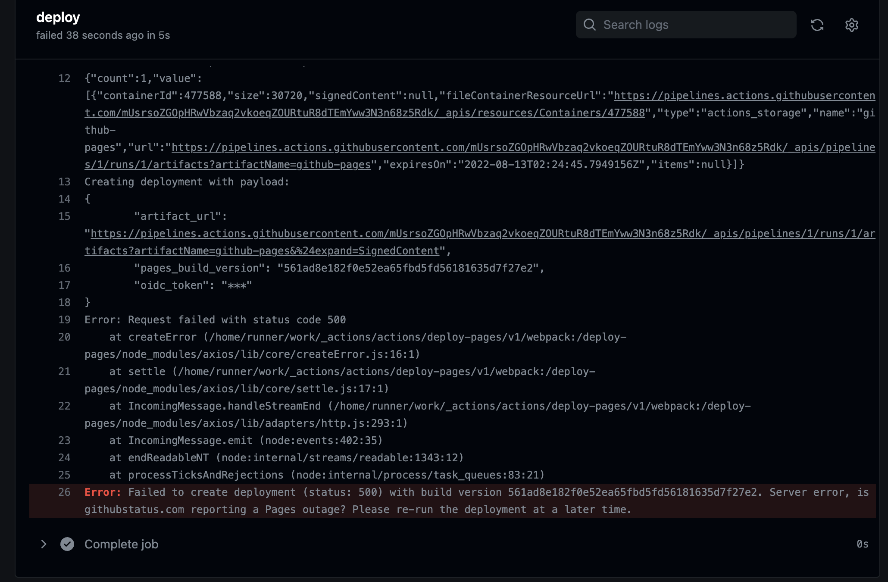
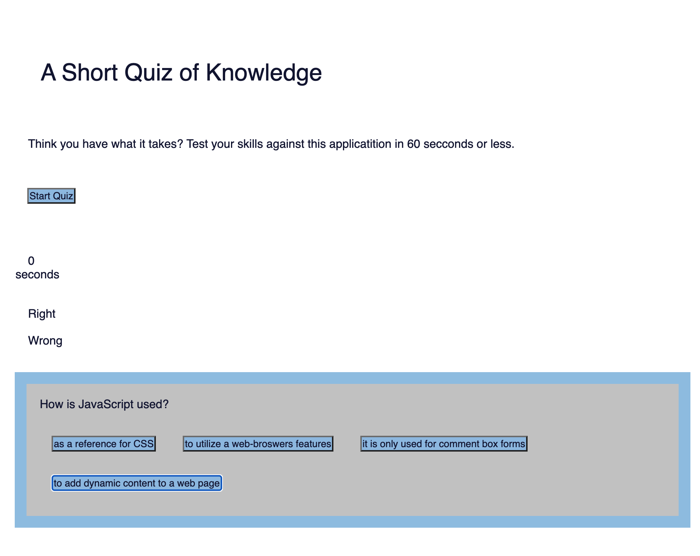
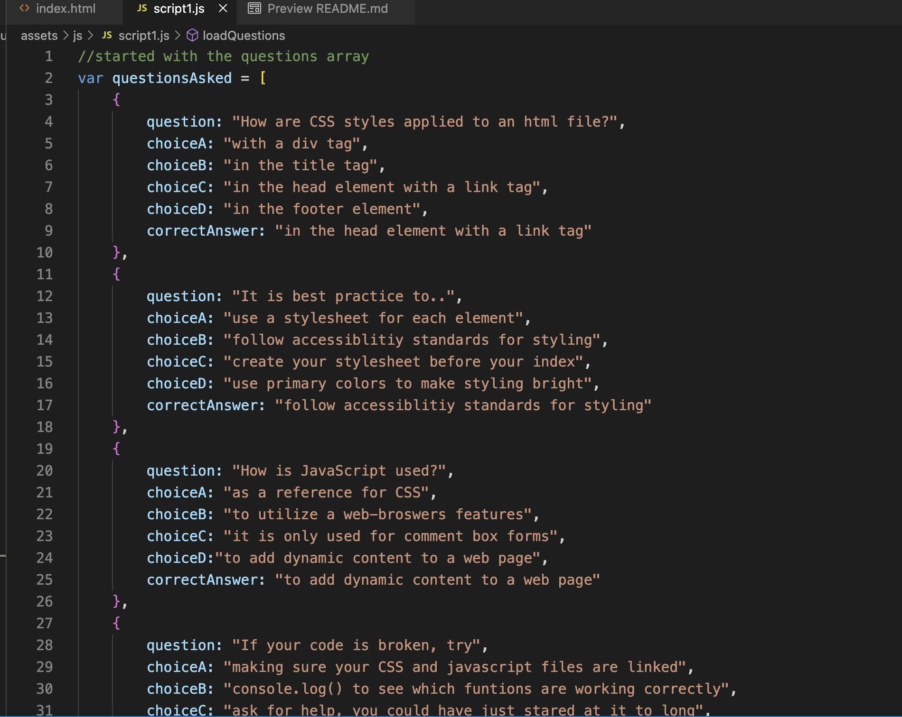
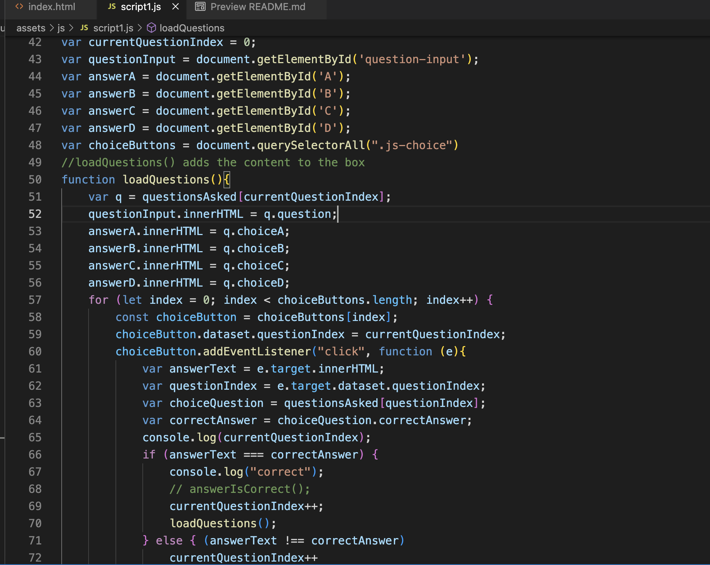

# Creating a quiz from scratch

This week we were tasked with creating a quiz from scratch. We needed add a score function, a timer ( with a function that removes time for incorrect answers ), and each correct and wrong answer needed to be stored in local storage for a scoreboard. While I went right in and created my HTML and CSS, I really struggles with the javascript this week. My app is not functional, and I really got hung up trying to run my questions and answers. They will populate, but stops at the 3rd ( the index[2]) question and throws errors that I am not understanding the why of. This evening when I pushed my code to begin taking screenshots of my deployed site, it failed due to a server error on githubs part. I inculded that screenshot instead on my deployed page. It is also not giving me my page url so here is my [repository](https://github.com/katsaymeow/Quiz-Show-With-The-Flow).

***

## **Steps I took in this assignment**

Well, It does not work. I will walk you through what I figured out. I started by looking for exsiting code out there for tutorials. I like to check them out, especially if there is a step by step instruction on how they built it. It will normally help me understand where is a good place to start, but this time it confused me. I am kinda realizing there are more ways to do everything and I am not really understanding all the working parts. My repo for class has some messed up solved solutions and I am not sure yet what is going on. I really got behind obsessing trying to get my code to work this week and still spent at least 20 hours outside of class attempting my code.  

Enough of that, here is my train of thought. I first started with a HTML and CSS backbone so I could see how it would load as I built the functionality. I used placeholders for my score, timer and buttons so that I could build into them. All box display is mostly HTML at this point, with a bit of CSS for a working style theme. I was planning on going in with my new knowledge of Bootstrap and clean it up. 

***

***

I knew I needed questions and a way to get them to load, so I went in with an array of objects. I wanted each question to load one object at a time and attempted this in a function. It will load and run until the third question and then throws errors on the reload function. I had help with a tutor to get it to iterate the questions, as I could only get it to pull up the first one on my own. My working script.js is script1. 

***

***

The error is on line 52 and again in the end of the function where that error keeps the iteration from happening. At this point I had put in what I believed was the right functions to work everything in the end. I do not know if they work other that VSCODE tells me they are not broken.

***

***

At this point my documentation is everywhere, with failed attempts at anything. I need to really understand how to create a planned workflow and even when I write it down on paper, I am getting lost in the process. I am trying not to overthink the answers, but it seems to happen that way. 

***

## Conclusion

I really wish I was able to fix this. I am going to move on to this weeks work for my weekend and hopefully my bootstrap, Jquery and Moment experience is more fluid. 

## Final moment

[My page deployed 😀](https://katsaymeow.github.io/Quiz-Show-With-The-Flow/) 

